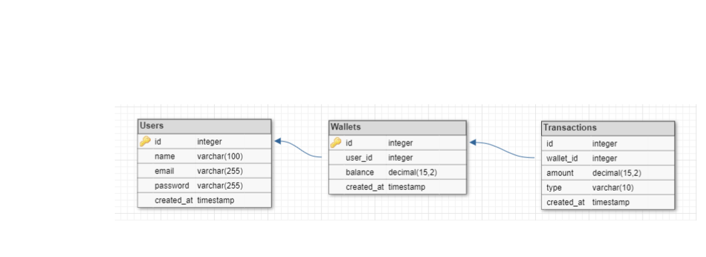

# DemoCredit

DemoCredit is a micro-lending platform designed to facilitate seamless financial transactions, including wallet funding, transfers, and withdrawals.

## Table of Contents

- [Description](#description)
- [Installation](#installation)
- [Usage](#usage)
- [API Documentation](#api-documentation)
- [Testing](#testing)
- [Entity Relationship Diagram](#entity-relationship-diagram)
- [Contributing](#contributing)
- [License](#license)
- [Contact Information](#contact-information)

## Description

DemoCredit provides an easy way to manage micro-loans and user transactions. The platform includes features like user registration, wallet management, and transaction processing.

## Installation

To install and set up the project, follow these steps:

1. Clone the repository:
    ```sh
    git clone https://github.com/yourusername/DemoCredit.git
    ```

2. Navigate to the project directory:
    ```sh
    cd DemoCredit
    ```

3. Install the dependencies:
    ```sh
    npm install
    ```

4. Set up environment variables:
    Create a `.env` file in the root directory and add the following:
    ```env
    DATABASE_URL=your-database-url
    KARMA_API_BASE_URL=your-karma-api-url
    KARMA_API_KEY=your-karma-api-key
    ```

5. Run the migrations:
    ```sh
    npx knex migrate:latest
    ```

6. Start the development server:
    ```sh
    npm run dev
    ```

## Usage

To use the application, follow these steps:

1. **Register a new user**: Send a POST request to `/api/users` with the user details.
2. **Fund a wallet**: Send a POST request to `/api/wallets/fund` with `userId` and `amount`.
3. **Transfer funds**: Send a POST request to `/api/wallets/transfer` with the transfer details.
4. **Withdraw funds**: Send a POST request to `/api/wallets/withdraw` with the withdrawal details.

## API Documentation

### Endpoints

#### User Endpoints

- **Create User**
    - URL: `/api/users`
    - Method: `POST`
    - Request Body:
      ```json
      {
        "name": "John Doe",
        "email": "john.doe@example.com",
        "password": "yourpassword"
      }
      ```
    - Response:
      ```json
      {
        "user": {
          "id": 1,
          "name": "John Doe",
          "email": "john.doe@example.com"
        },
        "wallet": {
          "id": 1,
          "user_id": 1,
          "balance": 0
        }
      }
      ```

#### Wallet Endpoints

- **Fund Wallet**
    - URL: `/api/wallets/fund`
    - Method: `POST`
    - Request Body:
      ```json
      {
        "userId": 1,
        "amount": 100.00
      }
      ```
    - Response:
      ```json
      {
        "message": "Wallet funded successfully",
        "wallet": {
          "id": 1,
          "user_id": 1,
          "balance": 100.00
        }
      }
      ```

- **Transfer Funds**
    - URL: `/api/wallets/transfer`
    - Method: `POST`
    - Request Body:
      ```json
      {
        "fromUserId": 1,
        "toUserId": 2,
        "amount": 50.00
      }
      ```
    - Response:
      ```json
      {
        "message": "Transfer successful",
        "fromWallet": {
          "id": 1,
          "user_id": 1,
          "balance": 50.00
        },
        "toWallet": {
          "id": 2,
          "user_id": 2,
          "balance": 50.00
        }
      }
      ```

- **Withdraw Funds**
    - URL: `/api/wallets/withdraw`
    - Method: `POST`
    - Request Body:
      ```json
      {
        "userId": 1,
        "amount": 25.00
      }
      ```
    - Response:
      ```json
      {
        "message": "Withdrawal successful",
        "wallet": {
          "id": 1,
          "user_id": 1,
          "balance": 25.00
        }
      }
      ```

## Testing

To run the tests, use the following command:

```sh
npm test
```
## Entity Relationship Diagram

The ERD for the project can be found below:


## Contributing

If you would like to contribute to this project, please follow these steps:

1. Fork the repository.
2. Create a new branch.
3. Make your changes.
4. Submit a pull request.

## License

This project is licensed under the MIT License.

## Contact Information

For more information, please contact:

- **Name**: OLAOPA VICTOR OLUSEGUN
- **Email**: olaopavictor@gmail.com
- **GitHub**: [VICTOR-OLAOPA](https://github.com/VICTOR-OLAOPA)